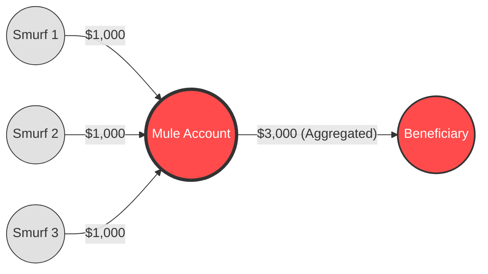

# 🧠 The Logic Behind FinGraph: GNNs for AML

This document explains the theoretical foundation of the FinGraph system. It details **how** the Graph Neural Network (GNN) detects suspicious activity and **why** it is superior to traditional rule-based systems for Anti-Money Laundering (AML).

## 1. The Core Problem: Why Graphs?

Traditional AML systems look at **rows in a spreadsheet**. They ask:
*   *"Did Account A send more than $10,000?"*
*   *"Is Account B in a high-risk country?"*

**The Flaw:** Money launderers are smart. They split large amounts into small, "safe" transactions (structuring/smurfing) to evade these simple rules.

**The Graph Solution:** FinGraph looks at the **relationships**. It models the data as a network:
*   **Nodes**: Accounts (People/Companies)
*   **Edges**: Transactions (Money flow)

By analyzing the *structure* of the network, we can detect patterns that look normal individually but suspicious collectively.

---

## 2. The Algorithm: Graph Attention Networks (GATv2)

We use a specific type of GNN called **GATv2 (Graph Attention Network v2)**.

### How it Works (The "Message Passing" Intuition)
Imagine every account in the network talks to its neighbors.
1.  **Message**: Account A tells Account B: *"I just received $500 from 10 different people."*
2.  **Aggregation**: Account B listens to all its neighbors.
3.  **Update**: Account B updates its own "Risk Score" based on what it heard.

### The "Attention" Mechanism
Not all neighbors are equal.
*   **Normal GNN (GCN)**: Treats all neighbors the same.
*   **GATv2 (Our Model)**: Learns to **pay attention** to specific neighbors.

**Example:**
*   Account X receives money from 100 people.
*   99 are paying for legitimate services (Coffee, Rent).
*   1 is a known criminal sending "clean" money.
*   **GATv2** learns to assign a **high attention weight** to that 1 criminal connection, effectively "flagging" the relationship, while ignoring the 99 noise connections.

---

## 3. Detecting a "Smurfing" Typology

Let's trace how FinGraph detects a classic **Smurfing** attack:

**The Scenario:**
A criminal wants to move $50,000. They split it into 50 transfers of $1,000 each, sent by 50 "Smurfs" (money mules) to one "Receiver" account.

### 📊 Visualizing the Pattern


**Step 1: Feature Engineering (Input)**
*   The **Smurfs** have `Out-Degree: 1`, `Out-Volume: $1000`. (Looks normal).
*   The **Receiver** has `In-Degree: 50`, `In-Volume: $50,000`. (Looks suspicious, but maybe they run a shop?).

**Step 2: The GNN Layer 1 (Local Context)**
*   The model looks at the **Edges** (Transactions). It sees 50 incoming edges of exactly $1,000.
*   It aggregates this pattern: *"High In-Degree + Low Average Transaction Amount"*.

**Step 3: The GNN Layer 2 (Global Context)**
*   The model looks at *who* sent the money.
*   If the Smurfs themselves received money from a **single source** just minutes before, the GNN propagates that "Risk" down the chain.
*   The Receiver's risk score spikes not just because they got money, but because they got money *from a coordinated network*.

---

## 4. Advanced: Multi-Task Topology Learning

To make the model "Commercial Grade," we don't just train it to find criminals. We also train it to **understand the graph structure**.

### The Auxiliary Task: Link Prediction
We added a secondary objective to the training loop:


*   **Task A (Primary):** Is this node Illicit? (Binary Classification)
*   **Task B (Auxiliary):** Are these two nodes connected? (Link Prediction)

**Why?**
By forcing the model to predict missing links, we compel it to learn **richer node embeddings** that capture the topology. If the model can predict that *Node A* is likely to send money to *Node B*, it has truly "understood" the flow of funds.

$$ Loss_{total} = Loss_{classification} + 0.5 \times Loss_{topology} $$

---

## 5. Technical Implementation Details

### The Model (`src/fingraph/core/model.py`)
```python
# Layer 1: Multi-Head Attention
# We use 4 "Heads". This means the model looks at the graph 
# from 4 different perspectives simultaneously.
self.conv1 = GATv2Conv(in_channels, hidden_channels, heads=4, edge_dim=1)
```

*   **`edge_dim=1`**: This is crucial. We feed the **Transaction Amount** into the edge. The model learns that *large amounts* might be more important than small ones, OR that *specific amounts* (like $9,999) are suspicious.

### The Loss Function (`BCEWithLogitsLoss`)
Since money laundering is rare (0.1% of data), we use a **Weighted Loss**.
*   If the model misses a launderer, we penalize it **50x more** than if it falsely accuses a normal person.
*   This forces the model to be paranoid and catch the "needle in the haystack."

---

## 5. Summary 

**"How does your AI detect money laundering?"**

"I built a system using **Graph Attention Networks (GATv2)**. Instead of just looking at individual transaction amounts, my model analyzes the **topology** of the transaction graph. It uses an **attention mechanism** to dynamically weigh the importance of different financial connections, allowing it to detect complex structural patterns like **smurfing rings** and **cyclic laundering** that traditional rule-based systems miss."
